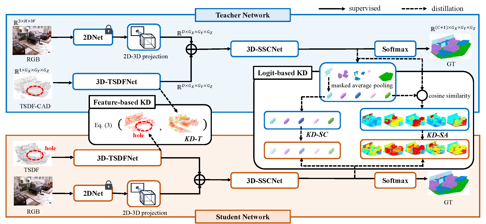
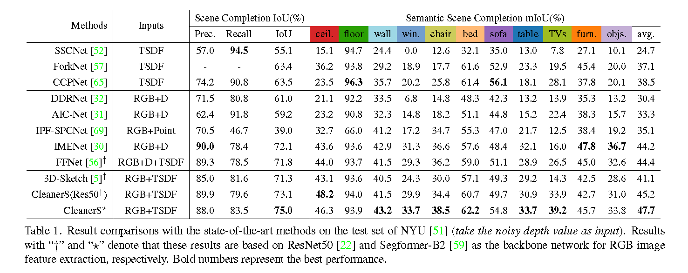

# CleanerS 

This repository contains the official PyTorch implementation of the following CVPR 2023 paper:

**CleanerS: Semantic Scene Completion with Cleaner Self**

[Fengyun Wang](https://fereenwong.github.io/), [Dong Zhang](https://dongzhang89.github.io/), [Hanwang Zhang](https://personal.ntu.edu.sg/hanwangzhang/), [Jinhui Tang](https://scholar.google.com/citations?user=ByBLlEwAAAAJ&hl=zh-CN), [Qianru Sun](https://qianrusun.com/)

NJUST, HKUST, NTU, SMU

## Abstract
<p align="justify">
Semantic Scene Completion (SSC) transforms an image of single-view depth and/or RGB 2D pixels into 3D voxels, each of whose semantic labels are predicted. SSC is a well-known ill-posed problem as the prediction model has to "imagine" what is behind the visible surface, which is usually represented by Truncated Signed Distance Function (TSDF). Due to the sensory imperfection of the depth camera, most existing methods based on the noisy TSDF estimated from depth values suffer from 1) incomplete volumetric predictions and 2) confused semantic labels. To this end, we use the ground-truth 3D voxels to generate a perfect visible surface, called TSDF-CAD, and then train a "cleaner" SSC model. As the model is noise-free, it is expected to focus more on the "imagination" of unseen voxels. Then, we propose to distill the intermediate "cleaner" knowledge into another model with noisy TSDF input. In particular, we use the 3D occupancy feature and the semantic relations of the "cleaner self" to supervise the counterparts of the "noisy self" to respectively address the above two incorrect predictions. Experimental results validate that our method improves the noisy counterparts with 3.1% IoU and 2.2% mIoU for measuring scene completion and SSC, and also achieves new state-of-the-art accuracy on the popular NYU dataset.

## The overall architecture
<p align="center"></p>
<p align="justify">
CleanerS mainly soncists of two networks: a teacher network, and a student network. These two networks share same architectures but have different weights. The distillation pipelines include a feature-based cleaner surface distillation (i.e., KD-T), and logit-based cleaner semantic distillations (i.e., KD-SC and KD-SA). The dimensions of the inputs and outputs in the student network are omitted as they are the same as in the teacher network.

## Pre-trained model
| Segformer-B2      |                    Model Zoo                    |                 Visual Results                 |
| :------------------ | :-----------------------------------------------: | :-----------------------------------------------: |
| Teacher Model     | [Google Drive](https://drive.google.com/file/d/1e8GZRFLMUM9WLoDm3GITJ6YV8solWMfk/view?usp=sharing) / [Baidu Netdisk](https://pan.baidu.com/s/1bc6ODl6VIjRBwgQ7wwypnA?pwd=3gew) with code:3gew | [Google Drive](https://drive.google.com/file/d/1jFCzMBj4l8itpDWzSgXaI8c4kYZlsrLX/view?usp=sharing) / [Baidu Netdisk](https://pan.baidu.com/s/1snrfT0BCX4JiW2hC6pYJnw?pwd=p9nl) with code:p9nl |
| **Student Model** | [Google Drive](https://drive.google.com/file/d/1LyUAPq4WaB-PxyrPZ0L33_a3aKgMK5aW/view?usp=sharing) / [Baidu Netdisk](https://pan.baidu.com/s/1puxavCn3nUr-eguJiqBdDw?pwd=6eja) with code:6eja | [Google Drive](https://drive.google.com/file/d/15jlkRQRp142zmoG7KREB5dBbLDufTqd8/view?usp=sharing) / [Baidu Netdisk](https://pan.baidu.com/s/1Sn0Iq3tEHxcFOG78Vg_6nQ?pwd=lktg) with code:lktg |

## Comparisons with SOTA
<p align="center">
  
</p>

## Usage
#### Requirements
- Pytorch 1.10.1
- cudatoolkit 11.1
- mmcv 1.5.0
- mmsegmentation 0.27.0

The suggested installation steps are:

```angular2html
conda create -n CleanerS python=3.7 -y
conda activate CleanerS
conda install pytorch==1.10.1 torchvision==0.11.2 torchaudio==0.10.1 cudatoolkit=11.1 -c pytorch -c conda-forge
pip install mmcv-full==1.5.0 -f https://download.openmmlab.com/mmcv/dist/cu111/torch1.10/index.html
pip install mmsegmentation==0.27.0
conda install scikit-learn
pip install pyyaml timm tqdm EasyConfig multimethod easydict termcolor shortuuid imageio
```

#### Data Preparation

We follow the project of [3D-Sketch](https://github.com/charlesCXK/TorchSSC) for dataset preparing. After preparing, `your_SSC_Dataset` folder should look like this:

````
-- your_SSC_Dataset
   | NYU
   |-- TSDF
   |-- Mapping
   |   |-- trainset
   |   |-- |-- RGB
   |   |-- |-- depth
   |   |-- |-- GT
   |   |-- testset
   |   |-- |-- RGB
   |   |-- |-- depth
   |   |-- |-- GT
   | NYUCAD
   |-- TSDF
   |   |-- trainset
   |   |-- |-- depth
   |   |-- testset
   |   |-- |-- depth
````

#### Training

- **on Segformer-B2**

1. Download the pretrained Segformer-B2, [mit_b2.pth](https://drive.google.com/drive/folders/1b7bwrInTW4VLEm27YawHOAMSMikga2Ia);
2. (optional) Download the [teacher model]() and put it into `./teacher/Teacher_ckpt.pth`;
3. Run `run.sh` for training the CleanerS (if you skip the step 2, it will train both teacher and student models).

- **on ResNet50**

1. Download the pretrained [ResNet50](https://drive.google.com/drive/folders/121yZXBZ8wV77WRXRur86YBA4ifJEhsJQ).
2.

#### Testing with our weights

1. Download our [weights]() and then put it in the `./checkpoint` folder.
2. Run ``python test_NYU.py --pretrained_path ./checkpoint/CleanerS_ckpt.pth``. The visualized results will be in the `./visual_pred/CleanerS` folder.
3. (optional) Run ``python test_NYU.py --pretrained_path ./checkpoint/Teacher_ckpt.pth`` to get the results of the teacher model.

## Citation
If this work is helpful for your research, please consider citing:
```
citation
```

## TODO list
- [ ] BibTeX for citation
- [ ] arixv link of the paper
- [ ] switchable 2DNet for both Segformer-B2 and ResNet50

## Acknowledgement
This code is based on [3D-Sketch](https://github.com/charlesCXK/TorchSSC). 